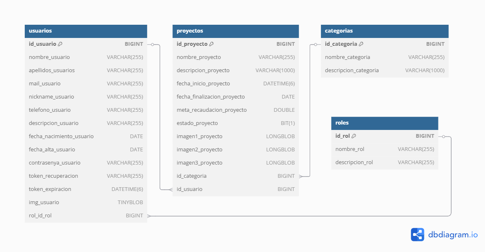

# ApiBoostly

## Descripción
ApiBoostly es una API desarrollada con Spring Boot para la gestión de usuarios, proyectos y categorías. Proporciona endpoints para la administración de usuarios, autenticación, gestión de roles y manejo de proyectos y categorías.

## Tecnologías Utilizadas
- **Java 17**
- **Spring Boot** (para el desarrollo de la API)
- **Spring Security** (para la autenticación y autorización)
- **JPA/Hibernate** (para la persistencia de datos)
- **Maven** (para la gestión de dependencias)
- **Base de Datos**: MySQL/PostgreSQL (según configuración)

## Instalación y Configuración
### Prerrequisitos
- Tener instalado Java 17 o superior.
- Tener instalado Maven.
- Tener una base de datos configurada (MySQL o PostgreSQL).

### Pasos para ejecutar el proyecto
1. Clonar el repositorio:
   ```sh
   git clone https://github.com/Clipertrucado/ApiBoostly.git
   cd ApiBoostly
   ```
2. Configurar el archivo `application.properties` en `src/main/resources/` con los datos de conexión a la base de datos.
3. Construir el proyecto con Maven:
   ```sh
   mvn clean install
   ```
4. Ejecutar la aplicación:
   ```sh
   mvn spring-boot:run
   ```

## Endpoints Principales

### Categorías
- `GET /api/categorias` - Lista todas las categorías.
- `GET /api/categorias/{id}` - Obtiene una categoría por ID.

### Proyectos
- `GET /api/proyectos` - Lista los proyectos.
- `GET /api/proyectos/usuario/{idUsuario}` - Obtiene los proyectos de un usuario específico.
- `GET /api/proyectos/{id}` - Obtiene un proyecto específico.
- `GET /api/proyectos/categoria/{idCategoria}` - Obtiene los proyectos de una categoría específica.
- `POST /api/proyectos/{id}` - Crea un nuevo proyecto.
- `PUT /api/proyectos/{id}` - Actualiza un proyecto.
- `DELETE /api/proyectos/{id}` - Elimina un proyecto.

### Roles
- `GET /api/roles` - Lista todos los roles.
- `GET /api/roles/{id}` - Obtiene un rol por ID.
- `DELETE /api/roles/{id}` - Elimina un rol.

### Usuarios
- `GET /api/usuarios` - Obtiene la lista de usuarios.
- `GET /api/usuarios/{id}` - Obtiene un usuario por ID.
- `PUT /api/usuarios/{id}` - Actualiza un usuario.
- `GET /api/usuarios/email/{email}` - Obtiene un usuario por su email.
- `POST /api/usuarios/generar-token` - Genera un token para recuperación de contraseña.
- `POST /api/usuarios/reset-password` - Restablece la contraseña de un usuario.

## Seguridad
El sistema utiliza Spring Security con JWT para la autenticación. Cada solicitud debe incluir el token JWT en la cabecera `Authorization`:
```sh
Authorization: Bearer {token}
```

## Estructura del Proyecto
```
ApiBoostly/
├── src/
│   ├── main/
│   │   ├── java/cliper/apiBoostly/
│   │   │   ├── controladores/  # Controladores REST
│   │   │   ├── daos/           # Entidades JPA
│   │   │   ├── dtos/           # Data Transfer Objects
│   │   │   ├── repository/     # Repositorios JPA
│   │   │   ├── servicios/      # Metodos manejo de datos
│   │   ├── resources/
│   │   │   ├── application.properties  # Configuración
│   ├── test/
│   │   ├── java/cliper/apiBoostly/      # Pruebas unitarias
└── pom.xml  # Dependencias de Maven
```
### Diagrama Entidad-Relación

A continuación se muestra el diagrama entidad-relación de la base de datos Boostly:




-- MySQL dump 10.13  Distrib 8.0.41, for Linux (x86_64)
--
-- Host: localhost    Database: boostly
-- ------------------------------------------------------
-- Server version       8.0.41-0ubuntu0.22.04.1

/*!40101 SET @OLD_CHARACTER_SET_CLIENT=@@CHARACTER_SET_CLIENT */;
/*!40101 SET @OLD_CHARACTER_SET_RESULTS=@@CHARACTER_SET_RESULTS */;
/*!40101 SET @OLD_COLLATION_CONNECTION=@@COLLATION_CONNECTION */;
/*!50503 SET NAMES utf8mb4 */;
/*!40103 SET @OLD_TIME_ZONE=@@TIME_ZONE */;
/*!40103 SET TIME_ZONE='+00:00' */;
/*!40014 SET @OLD_UNIQUE_CHECKS=@@UNIQUE_CHECKS, UNIQUE_CHECKS=0 */;
/*!40014 SET @OLD_FOREIGN_KEY_CHECKS=@@FOREIGN_KEY_CHECKS, FOREIGN_KEY_CHECKS=0 */;
/*!40101 SET @OLD_SQL_MODE=@@SQL_MODE, SQL_MODE='NO_AUTO_VALUE_ON_ZERO' */;
/*!40111 SET @OLD_SQL_NOTES=@@SQL_NOTES, SQL_NOTES=0 */;

--
-- Table structure for table `categorias`
--

DROP TABLE IF EXISTS `categorias`;
/*!40101 SET @saved_cs_client     = @@character_set_client */;
/*!50503 SET character_set_client = utf8mb4 */;
CREATE TABLE `categorias` (
  `id_categoria` bigint NOT NULL AUTO_INCREMENT,
  `descripcion_categoria` varchar(1000) NOT NULL,
  `nombre_categoria` varchar(255) NOT NULL,
  PRIMARY KEY (`id_categoria`)
) ENGINE=InnoDB AUTO_INCREMENT=2 DEFAULT CHARSET=utf8mb4 COLLATE=utf8mb4_0900_ai_ci;
/*!40101 SET character_set_client = @saved_cs_client */;

--
-- Table structure for table `proyectos`
--

DROP TABLE IF EXISTS `proyectos`;
/*!40101 SET @saved_cs_client     = @@character_set_client */;
/*!50503 SET character_set_client = utf8mb4 */;
CREATE TABLE `proyectos` (
  `estado_proyecto` bit(1) NOT NULL,
  `fecha_finalizacion_proyecto` date DEFAULT NULL,
  `meta_recaudacion_proyecto` double NOT NULL,
  `fecha_inicio_proyecto` datetime(6) NOT NULL,
  `id_categoria` bigint NOT NULL,
  `id_proyecto` bigint NOT NULL AUTO_INCREMENT,
  `id_usuario` bigint NOT NULL,
  `descripcion_proyecto` varchar(1000) NOT NULL,
  `nombre_proyecto` varchar(255) NOT NULL,
  `imagen1_proyecto` longblob,
  `imagen2_proyecto` longblob,
  `imagen3_proyecto` longblob,
  PRIMARY KEY (`id_proyecto`),
  KEY `FKjc9vdmea6wjqxv3jlyf7df4t2` (`id_categoria`),
  KEY `FK2mxm4r5it9s1tpayg2nxbdxlq` (`id_usuario`),
  CONSTRAINT `FK2mxm4r5it9s1tpayg2nxbdxlq` FOREIGN KEY (`id_usuario`) REFERENCES `usuarios` (`id_usuario`),
  CONSTRAINT `FKjc9vdmea6wjqxv3jlyf7df4t2` FOREIGN KEY (`id_categoria`) REFERENCES `categorias` (`id_categoria`)
) ENGINE=InnoDB AUTO_INCREMENT=17 DEFAULT CHARSET=utf8mb4 COLLATE=utf8mb4_0900_ai_ci;
/*!40101 SET character_set_client = @saved_cs_client */;

--
-- Table structure for table `roles`
--

DROP TABLE IF EXISTS `roles`;
/*!40101 SET @saved_cs_client     = @@character_set_client */;
/*!50503 SET character_set_client = utf8mb4 */;
CREATE TABLE `roles` (
  `id_rol` bigint NOT NULL AUTO_INCREMENT,
  `descripcion_rol` varchar(255) DEFAULT NULL,
  `nombre_rol` varchar(255) NOT NULL,
  PRIMARY KEY (`id_rol`)
) ENGINE=InnoDB AUTO_INCREMENT=2 DEFAULT CHARSET=utf8mb4 COLLATE=utf8mb4_0900_ai_ci;
/*!40101 SET character_set_client = @saved_cs_client */;

--
-- Table structure for table `usuarios`
--

DROP TABLE IF EXISTS `usuarios`;
/*!40101 SET @saved_cs_client     = @@character_set_client */;
/*!50503 SET character_set_client = utf8mb4 */;
CREATE TABLE `usuarios` (
  `fecha_alta_usuario` date DEFAULT NULL,
  `fecha_nacimiento_usuario` date DEFAULT NULL,
  `google_usuario` bit(1) DEFAULT NULL,
  `id_usuario` bigint NOT NULL AUTO_INCREMENT,
  `rol_id_rol` bigint NOT NULL,
  `token_expiracion` datetime(6) DEFAULT NULL,
  `apellidos_usuarios` varchar(255) NOT NULL,
  `contrasenya_usuario` varchar(255) NOT NULL,
  `descripcion_usuario` varchar(255) DEFAULT NULL,
  `dni_usuario` varchar(255) DEFAULT NULL,
  `mail_usuario` varchar(255) NOT NULL,
  `nickname_usuario` varchar(255) DEFAULT NULL,
  `nombre_usuario` varchar(255) NOT NULL,
  `telefono_usuario` varchar(255) DEFAULT NULL,
  `token_recuperacion` varchar(255) DEFAULT NULL,
  `img_usuario` tinyblob,
  PRIMARY KEY (`id_usuario`),
  KEY `FKldjb4kb5qjedbdiwattqdx8v2` (`rol_id_rol`),
  CONSTRAINT `FKldjb4kb5qjedbdiwattqdx8v2` FOREIGN KEY (`rol_id_rol`) REFERENCES `roles` (`id_rol`)
) ENGINE=InnoDB AUTO_INCREMENT=7 DEFAULT CHARSET=utf8mb4 COLLATE=utf8mb4_0900_ai_ci;
/*!40101 SET character_set_client = @saved_cs_client */;
/*!40103 SET TIME_ZONE=@OLD_TIME_ZONE */;

/*!40101 SET SQL_MODE=@OLD_SQL_MODE */;
/*!40014 SET FOREIGN_KEY_CHECKS=@OLD_FOREIGN_KEY_CHECKS */;
/*!40014 SET UNIQUE_CHECKS=@OLD_UNIQUE_CHECKS */;
/*!40101 SET CHARACTER_SET_CLIENT=@OLD_CHARACTER_SET_CLIENT */;
/*!40101 SET CHARACTER_SET_RESULTS=@OLD_CHARACTER_SET_RESULTS */;
/*!40101 SET COLLATION_CONNECTION=@OLD_COLLATION_CONNECTION */;
/*!40111 SET SQL_NOTES=@OLD_SQL_NOTES */;

-- Dump completed on 2025-03-07  6:06:17

